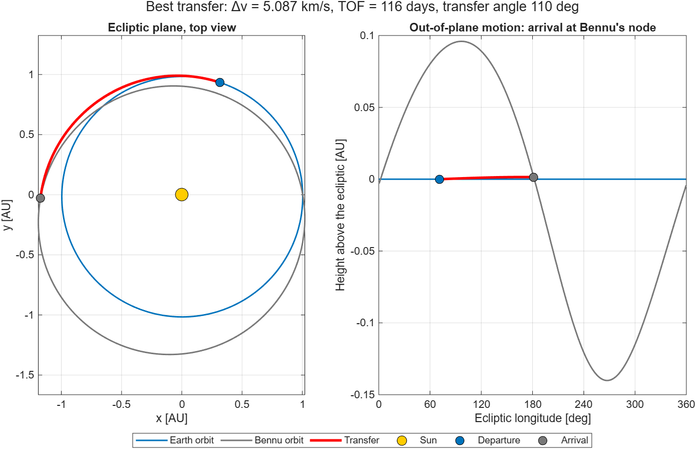
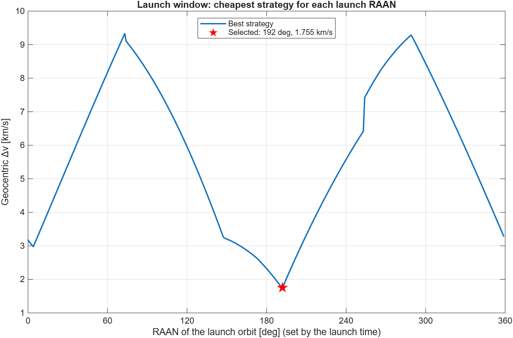
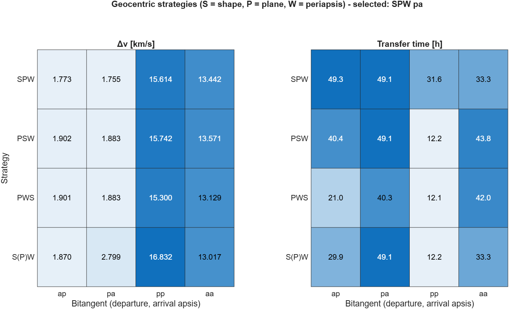
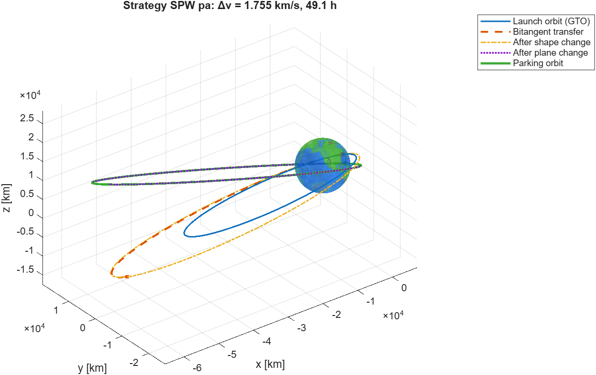
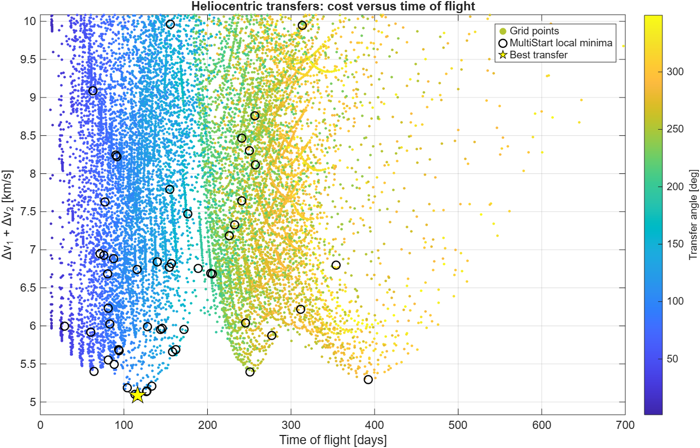
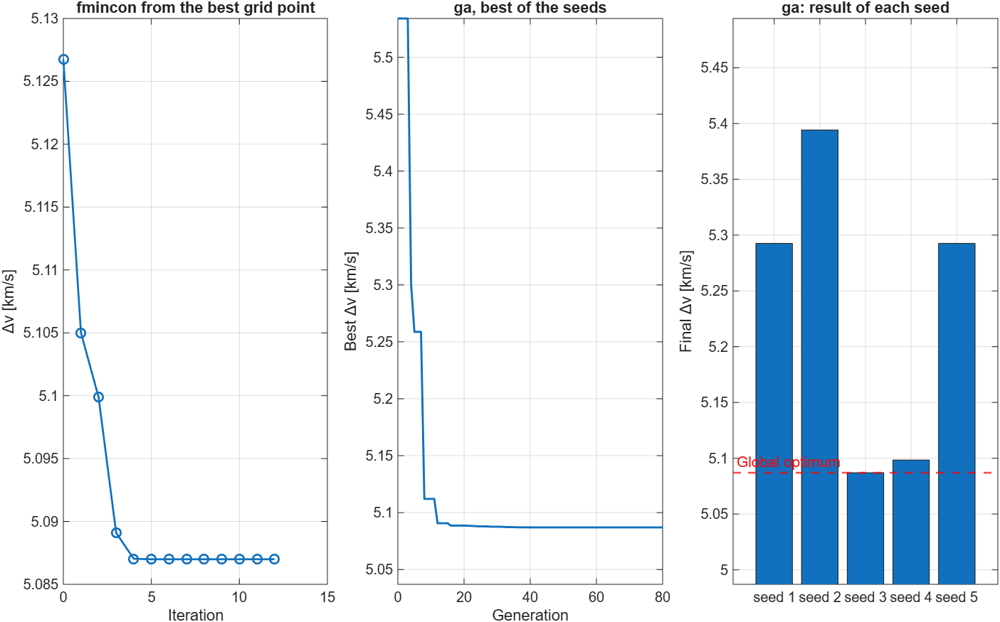
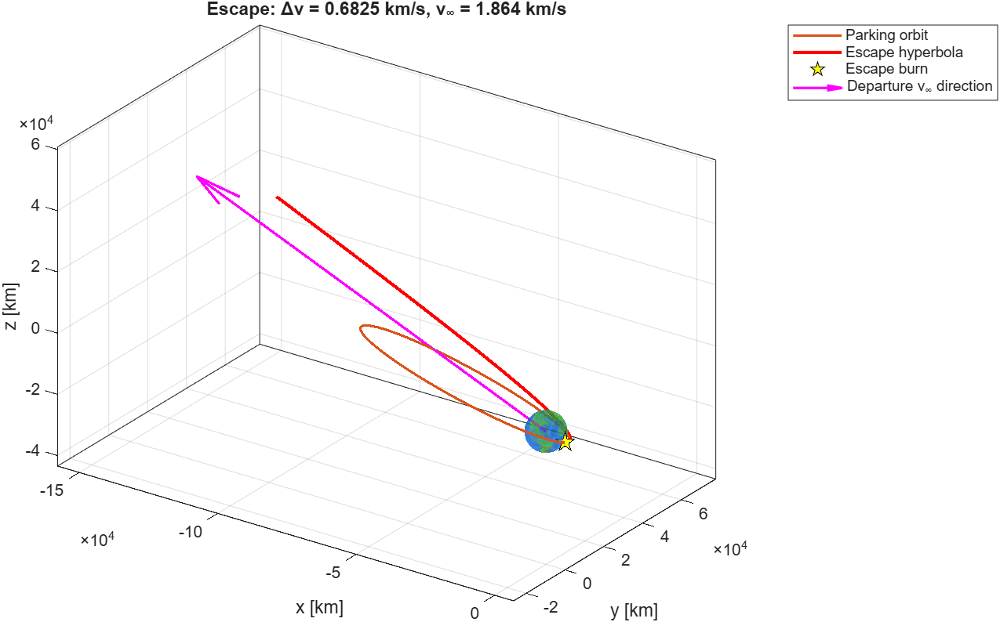
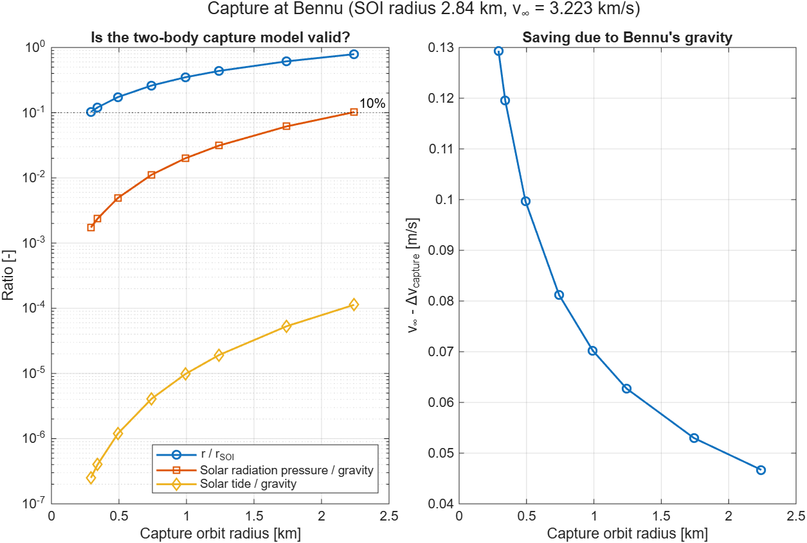

# Earth → Bennu: preliminary mission analysis in MATLAB and Python

[](https://github.com/sebastiano-golinelli/earth-to-bennu-mission-analysis/actions/workflows/matlab-tests.yml)
[](https://github.com/sebastiano-golinelli/earth-to-bennu-mission-analysis/actions/workflows/python-tests.yml)

Preliminary design of a mission from a geostationary transfer orbit (GTO) to the near-Earth asteroid **101955 Bennu**, the target of NASA's OSIRIS-REx. The analysis covers the three classic phases of an interplanetary mission with impulsive maneuvers and patched conics:

1. **Geocentric transfer**: from the launch orbit to a parking orbit, comparing 16 maneuver strategies.
2. **Heliocentric transfer**: two-impulse transfer Earth → Bennu, optimized with grid search, `fmincon`, `ga` and `MultiStart`.
3. **Patched conics**: escape from Earth and capture at Bennu, including a full 3D (non-coplanar) escape.

The analysis is written in MATLAB and fully ported to Python (NumPy, SciPy, Matplotlib): the two versions are cross-checked and agree to machine precision. All values are computed from public data (JPL Small-Body Database, OSIRIS-REx results), and both versions are verified by automated test suites that run on GitHub at every change.

| Phase | Δv [km/s] | Duration |
|---|---|---|
| GTO → parking orbit (strategy SPW pa) | 1.755 | 49 h |
| Earth escape (3D, from the parking orbit) | 0.683 | |
| Heliocentric cruise | none (coast) | 116 days |
| Arrival at Bennu (rendezvous) | 3.223 | |
| **Total** | **5.660** | **≈ 123 days** |



## Highlights

- **MATLAB → Python port, cross-validated.** The Python version reproduces the MATLAB results to machine precision (relative differences below 10⁻¹³) and reaches the same optimum with SciPy's optimizers. Its vectorized grid search evaluates 72,000 transfers in 0.07 s, against 6.1 s for the MATLAB loop. Details in [`python/README.md`](python/README.md).
- **Parking orbit designed around the departure asymptote.** The parking orbit is not imposed. It is computed from the optimal heliocentric transfer: its plane contains the departure excess velocity and its periapsis is placed so that a tangential burn sends the spacecraft exactly along it. The general 3D escape solver, which knows nothing about this design, confirms it: the escape costs 0.6825 km/s, against 0.6824 km/s for the ideal coplanar estimate.
- **Launch window study.** The launch time sets the orientation (RAAN) of the GTO. Sweeping it changes the cost of the geocentric phase from **1.75 to 9.33 km/s**, a much larger effect than the choice of maneuver strategy.
- **Optimizer comparison on a multimodal problem.** 59 distinct local minima are found. `ga` with typical settings reaches the global optimum with only 1 seed out of 5: the other runs stop in local minima, two of them on a long-arc transfer with 393 days of flight. A local refinement with `fmincon` and a `MultiStart` search both recover the optimum reliably.
- **Model validity at a tiny body.** Bennu's sphere of influence has a radius of only **2.84 km** and its gravity changes the arrival cost by less than 0.2 m/s. The "capture" is in practice a rendezvous, and the code quantifies when the two-body model stops being reliable (solar radiation pressure reaches 10% of Bennu's gravity at about 2.2 km).
- **Verification.** 15 MATLAB and 16 Python automated tests, run on GitHub at every change. They include checks independent of the formulas under test: numerical propagation of the transfer, geometric continuity of every maneuver, the escape asymptote recomputed from the post-burn state, and the comparison between the two languages.

## Results

The heliocentric transfer is solved first, because it fixes the departure direction that the parking orbit and the geocentric transfer depend on. The phases are presented here in mission order.

### 1. Launch window and geocentric transfer

The spacecraft starts in a GTO from Cape Canaveral (185 × 35,786 km, 27°) and must reach a 600 × 60,000 km parking orbit. Four strategies are compared, each with four bitangent transfers (ap, pa, pp, aa: departure and arrival apses):

| Strategy | Sequence of maneuvers |
|---|---|
| SPW | shape change (bitangent) → plane change → periapsis rotation |
| PSW | plane change → shape change → periapsis rotation |
| PWS | plane change → periapsis rotation → shape change |
| S(P)W | shape change with the plane change moved inside the transfer arc → periapsis rotation |

On a highly eccentric orbit, rotating the apse line is very expensive (up to several km/s), so the relative orientation of the GTO and of the parking orbit dominates the cost. That orientation depends on the launch time:



With the best launch RAAN (192°) the cheapest strategy is **SPW pa: 1.755 km/s in 49 hours**. The faster pp and aa variants cost over 13 km/s.





### 2. Heliocentric transfer Earth → Bennu

The transfer is described by three angles: departure point on Earth's orbit, arrival point on Bennu's orbit and argument of perihelion of the transfer ellipse. The model accepts both short (< 180°) and long (> 180°) arcs with prograde motion.

| Method | Δv [km/s] | Δv₁ + Δv₂ [km/s] | TOF [days] |
|---|---|---|---|
| Grid search (30 × 30 × 80) | 5.127 | 1.870 + 3.257 | 113.3 |
| `fmincon` from the best grid point | 5.087 | 1.864 + 3.223 | 116.3 |
| `ga`, best of 5 seeds | 5.087 | 1.864 + 3.223 | 116.3 |
| `MultiStart`, 200 points | 5.087 | 1.864 + 3.223 | 116.3 |

The optimal transfer crosses 110° of heliocentric longitude and stays almost in the ecliptic (inclination 0.08°). It meets Bennu 0.7° away from its descending node, so the 6° inclination of Bennu's orbit is matched by the arrival burn and not by a costly plane change at departure.



The search space is multimodal: `MultiStart` finds 59 distinct valid local minima. Four of the five `ga` runs stop in a different basin: 5.098 km/s (113 days), 5.293 km/s (two runs, long arc of 288° and 393 days) and 5.394 km/s (arc of 250°, 251 days):



### 3. Earth escape and capture at Bennu

The departure excess velocity is 1.864 km/s (C3 = 3.47 km²/s²), with declination 8.2° in the equatorial frame. Since this is below the GTO inclination, the parking orbit can keep the 27° inclination and contain the asymptote.



At Bennu, patched conics reach their limit. The sphere of influence is 2.84 km (Earth's is 924,649 km), and the arrival hyperbola has an eccentricity of the order of 10⁹, practically a straight line:



The arrival burn therefore equals the excess velocity (3.223 km/s) to within 0.2 m/s, whatever the capture orbit. The real constraint on the final orbit is solar radiation pressure, which is why OSIRIS-REx flew special terminator orbits at radii of about 1–2 km.

## Verification

```
runtests('tests')    % 15 tests, about 35 s
```

The MATLAB and Python test suites run automatically on GitHub Actions at every push (badges at the top of this page).

| Test class | What it checks |
|---|---|
| `TestOrbitalMechanics` | Keplerian ↔ Cartesian round trip on 200 random orbits, energy and angular momentum, time of flight against numerical integration |
| `TestManeuvers` | Bitangent transfer against the Hohmann formula; for 300 random plane and periapsis changes, the burn point lies on both orbits and the impulse equals the velocity difference; continuity of the transfer with the plane change inside the arc |
| `TestMission` | Regression values; agreement of the optimizers; the optimal transfer propagated numerically reaches Bennu (error < 1 km); the escape asymptote recomputed from the post-burn state matches the required excess velocity (angle < 10⁻⁶ rad) |

## Python version

The Python version is in [`python/`](python). Its test suite compares it with results exported from MATLAB: the deterministic quantities agree to machine precision and the optimizers converge to the same optimum within 10⁻¹² km/s. See [`python/README.md`](python/README.md) for the comparison tables, the porting notes and how to run it.

## Model assumptions and limitations

- Impulsive maneuvers, two-body dynamics and patched conics.
- No ephemerides: the analysis finds the best relative geometry of Earth and Bennu, not a launch date. A real mission would add the phasing (the Earth–Bennu synodic period is about 6 years) and solve Lambert's problem on actual dates.
- Earth is on its mean J2000 orbit; Bennu is a point mass with its measured GM.
- The parking orbit phase follows the structure of the original exercise. A real mission would more likely escape directly from the GTO perigee.
- OSIRIS-REx used an Earth gravity assist and deep-space maneuvers; its Δv budget is not directly comparable with this two-impulse transfer.

## How to run

Requirements: MATLAB R2022a or later and the Optimization Toolbox. The Global Optimization Toolbox (`ga`, `MultiStart`) is optional: without it those steps are skipped. Developed and tested on MATLAB R2026a.

Download or clone the repository, open MATLAB, make the repository folder the current folder, then run:

```matlab
cd path/to/earth-to-bennu-mission-analysis   % the folder that contains main.m
main              % runs the mission, prints the results and draws the figures (about 30 s)
runtests('tests') % runs the test suite
```

For the Python version see [`python/README.md`](python/README.md).

All data and options are in `config/missionConfig.m`, for example:

| Option | Effect |
|---|---|
| `cfg.sc2.allowLongArc` | `false` restricts the transfer to arcs shorter than 180° |
| `cfg.sc1.launchRaan` | `'optimize'` or a fixed launch RAAN in degrees |
| `cfg.sc1.parking.mode` | `'designed'` (aligned with the asymptote) or `'given'` (state vector) |
| `cfg.sc1.selection` | `'minDeltaV'`, `'minTime'` or a strategy such as `'PSW ap'` |
| `cfg.plot.export` | `true` saves the figures as PNG in `figures/` |

## Repository structure

```
main.m                     entry point
config/missionConfig.m     data and options
src/core/                  Keplerian elements, time of flight, frames
src/maneuvers/             bitangent transfer, plane change, periapsis rotation
src/scenario1/             geocentric strategies, parking orbit design, launch window
src/scenario2/             heliocentric transfer model and optimizers
src/scenario3/             escape and capture with patched conics
src/plotting/              figures
src/runMission.m           runs the three phases in sequence
tests/                     automated tests (matlab.unittest)
python/                    Python version, with its own tests and README
```

## Data sources

- Bennu orbit: JPL Small-Body Database, orbit solution 118, epoch 2011-01-01 TDB.
- Bennu GM = 4.8904 × 10⁻⁹ km³/s²: Chesley et al., *JGR Planets* 125 (2020).
- Bennu mean diameter = 0.48444 km: Daly et al., *Science Advances* 6 (2020).
- Earth orbit: mean J2000 elements, Standish, JPL *Approximate Positions of the Planets*.
- Constants: Sun GM from JPL DE405, Earth GM and radius from WGS-84, astronomical unit from IAU 2012, obliquity from IAU 2006.

## Background

This project started from a team lab of the course *Analisi di Missioni Aerospaziali* at Politecnico di Milano, which used a different target asteroid and given orbits. This repository is an independent rewrite with new data and new analyses: parking orbit design, launch window study, long-arc transfers, optimizer comparison, model validity at a small body and the test suite.

## License

MIT. See [LICENSE](LICENSE).

Sebastiano Enrico Golinelli
